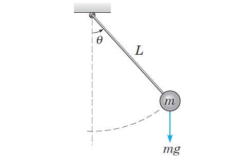
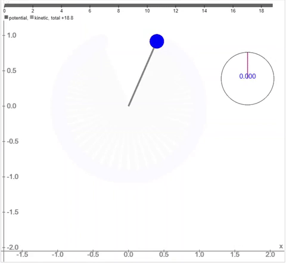
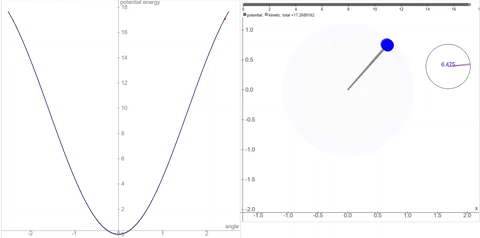

```{r setup, include=FALSE, fig.align="center"}
knitr::opts_chunk$set(echo = TRUE)
```

*Falta escribir una introducción* Antes de estudiar el péndulo doble comencemos por estudiar el péndulo simple. Sabemos que en la vida real los sistemas mecánicos son sumamente complicados

# Péndulo simple

## Péndulo ideal

Es evidente que en cualquier sistema en movimiento, la fuerza de fricción juega un papel fundamental. Sin embargo, para fines de este ejemplo no consideraremos esta fuerza en nuestro sistema.

Denominamos ideal este ejemplo por el hecho de que sucede, para nuestra conveniencia, en un mundo utópico que nos facilitará representar el péndulo de una manera sencilla a pesar de que se encuentra sumamente lejos de la realidad.

Podemos observar este péndulo en la **Figure 1**, el cual se compone de:

- Una vara rígida de longitud $l=1 \ \text{m}$ (sin masa).
- Una bola al final de la vara con masa $m =1 \ \text{kg}$.
- Un ángulo $\theta(t)$ que determina la posición de la vara al tiempo t.
- Una fuerza de gravedad que atrae la masa hacia abajo dada por $mg$.
    - $g$ como la aceleración de gravedad ($g = 9.8 \ m/s^2$ en la Tierra).

<center>
{height=300px}
</center>

Recordemos que solamente actúa externamente la fuerza de gravedad porque estamos asumiendo que no existe la fuerza de fricción. Como la masa se mueve alrededor de un círculo de radio $l$, entonces podemos definir las siguientes magnitudes:

- Fuerza tangencial (se opone al movimiento): $F_m=-mg\sin(\theta)$
- Velocidad angular: $\dot{\theta} = \frac{d\theta}{dt}$
- Velocidad de la partícula (m): $l\dot{\theta} = l\frac{d\theta}{dt}$

Por la Segunda Ley de Newton $F=ma$, escribimos la fuerza total de la partícula:

$$
\underbrace{m}_{m} \underbrace{l\ddot{\theta}}_{a} = \underbrace{-mg\sin({\theta})}_{F}
$$

Simplificando:

$$
\ddot{\theta} = -\frac{g}{l}\sin{(\theta)} = -g\sin{(\theta)}
$$ 

Reescribiendo como un sistema aplicando la sustitución para la velocidad angular $\omega=\dot{\theta}$ obtenemos:

$$
\begin{aligned}
\dot{\theta} &= \omega\\
\dot{\omega} &= -g\sin{(\theta)}
\end{aligned}
$$ 

Bajo los supuestos que utilizamos, ¡nuestro péndulo nunca se detiene!

<center>
{height=300px}
</center>

Podemos notar fácilmente que los puntos de equilibrio son de la forma $(\theta,\omega)=(k\pi,0)$ con $k \in \mathbb{Z}$ y ocurren cuando el péndulo se encuentra completamente vertical. 

Al ser un sistema conservativo, procederemos a analizarlo con un poco más de detenimiento mediante el método del potencial para poder esbozar su retrato fase.

Primero encontramos la energía potencial del sistema para confirmar la ubicación de los puntos de equilibrio:

$$
\begin{aligned}
u(\theta) & = - \int_{0}^{\theta} -g \sin(t) \,dt = -g \left(\cos(t)\right)\Big|_{0}^{\theta} = g \left(1 - \cos(\theta)\right) \\
u^{\prime}(\theta) & = g \sin(\theta) = 0 \iff \theta = k \pi \quad con \quad k \in \mathbb{Z}
\end{aligned}
$$

De igual manera, podemos analizar gráficamente cómo se comporta la energía potencial a lo largo del tiempo:

<center>
{height=300px}
</center>


Para cada nivel de energía $h$ tenemos que las órbitas del sistema están dadas por:

$$
\omega = \pm \sqrt{2\left(h-g\left(1-\cos(\theta)\right)\right)}
$$

Si graficamos para cada nivel de energía podemos esbozar el retrato fase:

<center>
{height=300px}
</center>

De esta manera podemos concluir que los puntos de equilibrio tienen estabilidad:

$$
(k\pi,0) =
\begin{cases}
\text{centros} & \text{si}\ k \text{ par} \\
\text{silla} & \text{si}\ k \text{ impar}
\end{cases}
$$


## Péndulo con fricción


Ahora vamos a empezar a tomar en cuenta la fricción. Supongamos que ésta es proporcional a la velocidad $\omega$. Tenemos que agregar un término a la ecuación de $\dot{\omega}$ de la forma $-b \omega$ con $b$ una constante positiva. El sistema resultante es:

$$
\begin{aligned}
\dot{\theta} & = \omega \\
\dot{\omega} & = -b \, \omega - g \sin(\theta)
\end{aligned}
$$

Los puntos de equilibrio son donde $\omega = 0$ y $\sin(\theta) = 0$. Es decir, son los puntos de la forma $(\theta, \omega) = (k \pi, 0) \; con \; k \in \mathbb{Z}$ (siguen siendo los mismos de antes).

Vamos a analizar el comportamiento cerca de los puntos de equilibrio utilizando la Jacobiana del sistema (y el teorema de Hartman--Grobman).

$$
Df(\theta, \omega) = \begin{pmatrix}
0 & 1 \\
-g \cos(\theta) & -b
\end{pmatrix}
$$

Para los puntos de equilibrio con un múltiplo par de $\pi$ tenemos:

$$
Df(2k\pi, 0) = \begin{pmatrix}
0 & 1 \\
-g  & -b
\end{pmatrix}
$$

Su polinomio característico y valores propios:

$$
\begin{aligned}
    p(\lambda) & = \lambda^2 + b \lambda + g \\
    p(\lambda) & = 0 \iff \lambda = \frac{-b \pm \sqrt{b^2-4g}}{2}
\end{aligned}
$$

Dependiendo del signo de $b^2-4g$ vamos a tener valores propios reales o complejos. Si asumimos que la fuerza de fricción no es demasiado fuerte y por lo tanto la constante $b$ no es muy grande, vamos a tener doe valores propios complejos con parte real negativa, por lo que el equilibrio va a ser espiral estable.

Para los puntos de equilibrio que son un múltiplo impar de $\pi$ tenemos:

$$
Df((2k+1)\pi, 0) = \begin{pmatrix}
0 & 1 \\
g  & -b
\end{pmatrix}
$$

Su polinomio característico y valores propios:

$$
\begin{aligned}
    p(\lambda) & = \lambda^2 + b \lambda - g \\
    p(\lambda) & = 0 \iff \lambda = \frac{-b \pm \sqrt{b^2+4g}}{2}
\end{aligned}
$$

Podemos ver que ambos valores propios son reales, uno positivo y uno negativo, por lo tanto tenemos un punto silla.

Para esbozar el retrato fase utilizaremos las ceroclinas.

$$
\begin{aligned}
    \dot{\theta} &= 0 \iff \omega = 0 \\
    \dot{\omega} &= -b \, \omega - g \sin(\theta) = 0  \iff \omega = - \frac{g}{b} \sin(\theta)
\end{aligned}
$$

```{=html}
<!--
\begin{figure}[h!]
\centering
\includegraphics[scale=0.7]{ceroclinas_pendulo_simple_con_friccion.png}
\caption{Fuente: Blanchard et al.}
\label{fig:ceroclinas_friccion}
\end{figure}
-->
```
Utilizando la información que tenemos hasta ahora podemos esbozar el retrato fase:

```{=html}
<!--
\begin{figure}[!hb]
\centering
\includegraphics[scale=0.5]{retrato_fase_pendulo_con_friccion.png}
\caption{Fuente: Blanchard et al.}
\label{fig:fase_pendulo_friccion}
\end{figure}
\clearpage
-->
```
Como podemos ver, el retrato fase es parecido al del péndulo sin fricción. La principal diferencia es que ahora hay espirales en lugar de las órbitas periódicas de antes. Esto se debe a que, debido a la frición, el péndulo ya no oscila indefinidamente, sino que cada vez la trayectoria es más corta y se va acercando poco a poco a la posición de equilibrio en la que el péndulo cuelga hacia abajo sin moverse (puntos de la forma $(\theta, \omega) = (2k\pi, 0)$).

# Péndulo doble

Consideremos ahora un péndulo que está unido a otro péndulo. Tenemos una masa $m_1$ unida por un una vara de longitud $l_1$ que, a su vez, tiene otra masa $m_2$ unida por medio de una vara de longitud $l_2$. Sean $\theta_1$ y $\theta_2$ los ángulos que forman cada una de estas varas con el eje vertical (ver figura).

```{=html}
<!--
\begin{figure}[h!]
\centering
\includegraphics[scale=0.7]{pendulo_doble.png}
\caption{Fuente: https://scienceworld.wolfram.com/physics/DoublePendulum.html}
\label{fig:pendulo_doble}
\end{figure}
-->
```
Este sistema no es tan sencillo. Para plantear las ecuaciones de este sistema necesitamos utilizar la ecuación de Euler-Lagrange.

Dadas la energía potencial $V$ de un sistema y su energía cinética $T$, definimos el Lagrangiano como:

$$
L = T - V
$$

La ecuación de Euler-Lagrange nos dice:

$$
    \frac{d}{dt} \left( \frac{\partial L}{\partial \dot{x}} \right) = \left( \frac{\partial L}{\partial x} \right)
$$

Para aplicarlo en nuestro caso tenemos que empezar por encontrar las coordenadas de cada uno de los puntos de masa:

$$
\begin{aligned}
    x_1 &= l_1 \sin(\theta_1) \\
    y_1 &= - l_1 \cos(\theta_1) \\
    x_2 &= l_1 \sin(\theta_1) + l_2 \sin(\theta_2) \\
    y_2 &= - l_1 \cos(\theta_1) - l_2 \cos(\theta_2) \\
\end{aligned}
$$

La energía potencial del sistema está dada por:

$$
\begin{aligned}
    V &= m_1 g y_1 + m_2 g y_2 \\
    &= -(m_1+m_2) g l_1 \cos(\theta_1) - m_2 g l_2 \cos(\theta_2)
\end{aligned}
$$

Para encontrar la energía cinética necesitamos primero los cuadrados de las velocidades $v_1$ y $v_2$:

$$
\begin{aligned}
    v_1^2 &= l_1^2 \dot{\theta}_1^2 \\
    v_2^2 &= l_1^2 \dot{\theta}_1^2 + l_2^2 \dot{\theta}_2^2 + 2 l_1 l_2 \dot{\theta}_1 \dot{\theta}_2 (\cos(\theta_1) \cos(\theta_2) + \sin(\theta_1) \sin(\theta_2)
\end{aligned}
$$

Entonces la energía cinética está dada por:

$$
\begin{aligned}
    T &= \frac{1}{2} m_1 v_1^2 + \frac{1}{2} m_2 v_2^2 \\
    &= \frac{1}{2} m_1 l_1^2 \dot{\theta}_1^2 + \frac{1}{2} m_2 [l_1^2 \dot{\theta}_1^2 + l_2^2 \dot{\theta}_2^2 + 2 l_1 l_2 \dot{\theta}_1 \dot{\theta}_2 \cos(\theta_1 - \theta_2)]
\end{aligned}
$$

El Lagrangiano es:

$$
    L = T - V = \frac{1}{2} (m_1+m_2) l_1^2 \dot{\theta}_1^2 + \frac{1}{2} m_2 l_2^2 \dot{\theta}_2^2 + m_2 l_1 l_2 \dot{\theta}_1 \dot{\theta}_2 \cos(\theta_1 - \theta_2) + (m_1+m_2) g l_1 \cos(\theta_1) + m_2 g l_2 \cos(\theta_2)
$$

Para $\theta_1$:

$$
\begin{aligned}
    \frac{\partial L}{\partial \dot{\theta_1}} &= m_1 l_1^2 \dot{\theta}_1 + m_2 l_1^2 \dot{\theta}_1 + m_2 l_1 l_2 \dot{\theta}_2 \cos(\theta_1 - \theta_2) \\
    \frac{d}{dt} \left( \frac{\partial L}{\partial \dot{\theta_1}} \right) &=  (m_1+m_2) l_1^2 \ddot{\theta}_1 + m_2 l_1 l_2 \ddot{\theta}_2 \cos(\theta_1 - \theta_2) - m_2 l_1 l_2 \dot{\theta}_2 \sin(\theta_1 - \theta_2) (\dot{\theta}_1 - \dot{\theta}_2) \\
    \frac{\partial L}{\partial \theta_1} &= - l_1 g (m_1+m_2) \sin(\theta_1) - m_2 l_1 l_2 \dot{\theta}_1 \dot{\theta}_2 \sin(\theta_1 - \theta_2) 
\end{aligned}
$$

Por lo tanto la ecuación de Euler-Lagrange para $\theta_1$ es:

$$
    (m_1 + m_2) l_1^2 \ddot{\theta}_1 + m_2 l_1 l_2 \ddot{\theta} \cos(\theta_1 - \theta_2) + m_2 l_1 l_2 \dot{\theta}_2^2 \sin(\theta_1 - \theta_2) + l_1 g (m_1+m_2) \sin(\theta_1) = 0
$$

Podemos hacer lo mismo para $\theta_2$ y la ecuación de Euler-Lagrange queda:

$$
    m_2 l_2^2 \ddot{\theta}_2 + m_2 l_1 l_2 \dot{\theta}_1^2 \cos(\theta_1 - \theta_2) - m_2 l_1 l_2 \dot{\theta}_1^2 \sin(\theta_1 - \theta_2) + l_2 m_2 g \sin(\theta_2) = 0
$$

